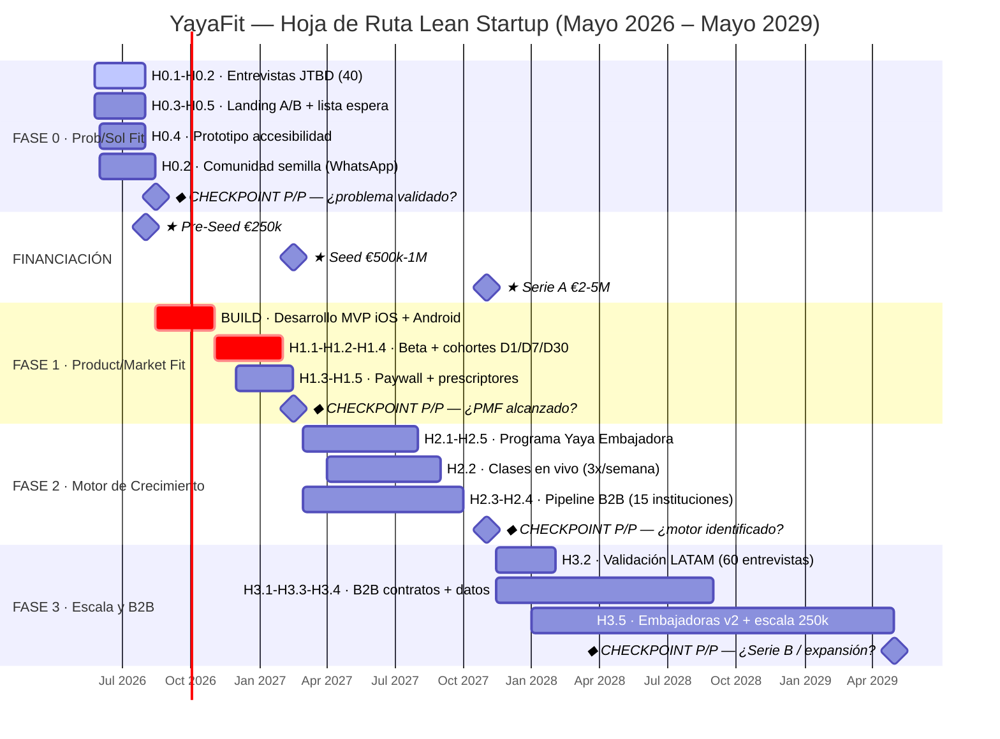

# YayaFit — Hoja de Ruta para Inversores

**Metodología Lean Startup · Build-Measure-Learn · Mayo 2026 – Mayo 2029**

> *"El objetivo de una startup es aprender lo que los clientes quieren, no construir lo que crees que quieren."*
> — Eric Ries, *The Lean Startup*

---

## Prefacio Metodológico

Este documento no es un plan de entrega de funcionalidades. Es un **plan de aprendizaje validado**.

Cada una de las cuatro fases de YayaFit es un ciclo Build-Measure-Learn: tiene hipótesis falsificables definidas antes de ejecutar, un experimento mínimo viable para testearlas, métricas de éxito y fracaso acordadas de antemano, y un checkpoint explícito al final donde el equipo decide pivotar o perseverar con datos reales.

Este enfoque responde la pregunta que todo inversor sofisticado plantea: **"¿Cómo sabrás cuando estás equivocado, y qué harás al respecto?"**

El progreso no se mide por features lanzadas. Se mide por **hipótesis confirmadas o refutadas con usuarias reales**.

### Los Tres Motores de Crecimiento (Eric Ries)

| Motor | Mecanismo | Indicador clave |
|-------|-----------|-----------------|
| **Sticky** | La usuaria permanece; el churn bajo financia el crecimiento | DAU/MAU >25%, churn <5%/mes |
| **Viral** | Cada usuaria trae a N nuevas usuarias | Coeficiente k >0.3 |
| **Paid** | LTV > CAC con margen para reinvertir en adquisición | LTV/CAC >3x |

**Hipótesis de arranque YayaFit:** El motor dominante será **Sticky + Viral emergente**. La comunidad crea hábito de retorno diario (motor Sticky) y el boca a boca entre mujeres de la misma generación genera viralidad orgánica (motor Viral). El motor Paid actuará como acelerador, no como motor principal. Esta hipótesis se valida en Fase 1-2.

---

## Resumen Ejecutivo del Roadmap

| Fase | Período | Inversión | Pregunta central |
|------|---------|-----------|-----------------|
| **0 · Prob/Sol Fit** | May–Ago 2026 | Bootstrap | ¿El problema existe a escala? |
| **1 · Product/Mkt Fit** | Ago 2026–Feb 2027 | Pre-Seed €250k | ¿El MVP retiene y convierte? |
| **2 · Motor de Crecimiento** | Feb–Nov 2027 | Seed €500k-1M | ¿Qué motor domina? ¿LTV/CAC >4x? |
| **3 · Escala y B2B** | Nov 2027–May 2029 | Serie A €2-5M | ¿B2B institucional es real? ¿LATAM viable? |

---

## Fase 0 — Ajuste Problema/Solución

**Mayo – Agosto 2026 · Bootstrap (~€10-15k) · Sin equipo técnico**

### Objetivo de Aprendizaje

Confirmar antes de invertir un euro en desarrollo si: (1) el problema existe a la escala necesaria para construir un negocio, (2) la solución conceptual resuena con el segmento, y (3) el precio es aceptable. Si fallamos aquí, el pivote es barato.

### Hipótesis Falsificables

**H0.1 — Las mujeres 60-75 se sienten desatendidas por las apps de fitness actuales**
Creemos que este segmento experimenta frustración activa con las apps existentes porque el contenido es intimidante o inadaptado. Lo testaremos con 40 entrevistas JTBD estructuradas. **Éxito: >65% de entrevistadas describen espontáneamente al menos un momento de abandono o frustración con apps actuales.**

**H0.2 — La comunidad y la conexión social es motivador igual o superior a la salud**
Creemos que las mujeres de este segmento hacen ejercicio (o no lo hacen) por razones sociales tanto como físicas. Lo testaremos con el mensaje A/B en la landing: mensaje A ("ejercicio adaptado para ti") vs. mensaje B ("encuentra a tu tribu de segunda juventud"). **Éxito: el mensaje social tiene CTR >1.5x el mensaje de salud; y "compañía/comunidad" aparece en top-3 motivaciones en >50% de entrevistadas.**

**H0.3 — Al menos el 8-10% del segmento pagaría €9,99/mes**
Creemos que existe disposición real a pagar por una solución adaptada. Lo testaremos con un botón de "pre-suscripción Premium" en la landing page y con la pregunta directa en entrevistas. **Éxito: >8% de visitantes hacen click en el botón Premium; >30% de entrevistadas dicen "probablemente sí" pagarían.**

**H0.4 — El diseño accesible es un requisito de mercado, no una mejora opcional**
Creemos que sin una interfaz diseñada específicamente para mayores (tipografía grande, navegación simple, lenguaje cercano), hay abandono en los primeros minutos. Lo testaremos mostrando un prototipo estándar vs. uno accesible a 15 mujeres sin asistencia externa. **Éxito: <30% necesitan ayuda en el prototipo accesible vs. >70% en el estándar.**

**H0.5 — La recomendación de médico/farmacéutico convierte 3x mejor que un anuncio**
Creemos que para este segmento, la figura de autoridad médica o de cercanía (farmacéutica, fisioterapeuta, médico de cabecera) es el canal de confianza principal. Lo testaremos con el campo "¿cómo nos conociste?" en el formulario de la lista de espera. **Éxito: >40% de suscriptoras provienen de canales de prescripción.**

### Experimento Mínimo Viable

No se construye ninguna app. El EMV es:

- **Landing page A/B** (Carrd o Webflow, 48h) con captura de email y botón de pre-suscripción Premium
- **Protocolo de 40 entrevistas JTBD** (reclutamiento en grupos de Facebook, asociaciones de jubiladas, centros cívicos de Madrid y Barcelona)
- **Prototipo Figma no interactivo** para el test de accesibilidad con 15 mujeres
- **Grupo WhatsApp de comunidad semilla** (50-100 mujeres del segmento) para observar comportamiento orgánico y señales del motor Viral

### Innovation Accounting — Fase 0

| Hipótesis | Línea base | Objetivo mínimo | Éxito claro | Método |
|-----------|-----------|----------------|-------------|--------|
| H0.1 Frustración documentada | 0% | 50% | 65% | Entrevistas JTBD codificadas |
| H0.2 CTR mensaje social vs. salud | Sin datos | 1.5x | 2x diferencia | A/B test UTM en landing |
| H0.3 CTR botón Premium | 0% | 5% | 8% | Heatmap + analytics |
| H0.3 "Pagaría" en entrevista | 0% | 20% | 30% | Encuesta post-entrevista |
| H0.4 Completar onboarding sin ayuda | Sin datos | 50% | 70% | Test de usabilidad presencial |
| H0.5 % suscriptoras via prescripción | 0% | 25% | 40% | Campo formulario registro |
| Lista de espera (emails) | 0 | 300 | 500 | Mailchimp/Brevo |

### Checkpoint — Pivotar o Perseverar (Agosto 2026)

**Perseverar → cerrar Pre-Seed y pasar a Fase 1** si se cumplen simultáneamente:
- H0.1 validada: >60% de frustración documentada
- H0.3 validada: >6% CTR en botón Premium
- Lista de espera >300 emails con tasa de apertura >40%

**Pivotar** si:
- Frustración <40%: el problema no existe a esa escala o el mensaje no conecta → pivotar el *positioning*, no el producto
- Disposición a pagar <5%: explorar modelo B2B-first con app gratuita desde el inicio
- Canal prescripción no aparece en datos: pivotar hacia redes sociales como canal primario y rediseñar go-to-market

**Motor emergente a observar:** señales de motor Viral si el grupo de WhatsApp crece por referidos sin intervención; señales de motor Sticky si las mujeres regresan al grupo diariamente por voluntad propia.

---

## Fase 1 — Ajuste Producto/Mercado

**Agosto 2026 – Febrero 2027 · Pre-Seed €250k · Equipo: Fundador/a + CTO + 1 Responsable de Contenido**

### Objetivo de Aprendizaje

Demostrar que el MVP retiene usuarias y convierte a Premium a las tasas proyectadas. Identificar cuál de las cuatro palancas (movimiento, comunidad, bienestar, acompañamiento) genera más retención. Establecer el CAC real por canal.

### Hipótesis Falsificables

**H1.1 — Onboarding <3 min logra retención D1 >60%**
Creemos que un onboarding personalizado de menos de 3 minutos (nivel, objetivo, frecuencia + bienvenida de comunidad) genera hábito inmediato. Lo testaremos con el cohorte de las primeras 500 usuarias activadas. **Éxito: D1 retention >60% en las primeras 4 semanas post-lanzamiento.**

**H1.2 — Usuarias con interacción de comunidad en semana 1 tienen D30 retention 2x superior**
Creemos que la palanca de comunidad es el predictor más fuerte de retención a largo plazo, más que la calidad del contenido fitness. Lo testaremos con segmentación de cohortes. **Éxito: D30 retention del grupo "interactuó con comunidad semana 1" es ≥2x el grupo "solo consumió contenido".**

**H1.3 — Conversión free→Premium >3% a los 90 días de activar el paywall**
Creemos que al menos 3 de cada 100 usuarias registradas activas pagarán €6.99/mes. Lo testaremos con el funnel de pago desde el día de lanzamiento del paywall (día 30 de uso). **Éxito: conversión acumulada >3% a los 90 días de disponibilidad del paywall.**

**H1.4 — DAU/MAU >25% señala hábito genuino**
Creemos que el diseño de comunidad y las notificaciones de check-in generan visitas diarias. Lo testaremos midiendo el ratio DAU/MAU a partir del primer cohorte activo 30 días. **Éxito: DAU/MAU >25% en el cohorte de usuarias con >30 días de antigüedad.**

**H1.5 — Canal de prescriptores genera CAC <€3**
Creemos que la recomendación personal de médicos, farmacias y centros cívicos reduce drásticamente la fricción de descarga. Lo testaremos con un piloto de 10 prescriptores con códigos únicos de seguimiento. **Éxito: CAC de prescriptores <€3 en el piloto de 10 colaboradores.**

### MVP — Solo lo necesario para testear H1.1-H1.5

**Incluido en el MVP:**
- Onboarding personalizado en <3 min (nivel, objetivo, frecuencia)
- Biblioteca de 20 rutinas en vídeo (fuerza, movilidad, equilibrio, cardio suave)
- Perfil de progreso básico (racha de días, rutinas completadas)
- Comunidad core: 1 grupo general + 1 reto semanal colectivo + muro moderado
- Paywall en día 30: clases en vivo (3/semana con entrenadora), grupos privados
- Notificaciones de recordatorio y comunidad

**No se construye en Fase 1** (sería muda sin validación previa):
- Planes de nutrición completos
- IA de personalización avanzada
- Gamificación compleja
- Integración con wearables

### Innovation Accounting — Fase 1

| Métrica | Línea base | Objetivo 90 días | Objetivo 180 días | Método |
|---------|-----------|-----------------|-------------------|--------|
| D1 Retention | 0% | >50% | >60% | Amplitude cohortes |
| D7 Retention | 0% | >30% | >40% | Amplitude cohortes |
| D30 Retention | 0% | >20% | >30% | Amplitude cohortes |
| D30 comunidad vs. solo-contenido | Sin datos | 1.5x | 2x | Segmentación cohortes |
| DAU/MAU | 0% | >20% | >25% | Dashboard diario |
| Conversión free→Premium | 0% | >2% | >3% | RevenueCat funnel |
| Churn Premium mensual | Sin datos | <8% | <5% | Stripe/RevenueCat |
| CAC prescriptores | Sin datos | <€8 | <€3 | CRM + UTM por prescriptor |
| CAC paid social | Sin datos | <€15 | <€10 | Meta Ads dashboard |
| NPS in-app | 0 | >50 | >60 | Encuesta Delighted |
| Usuarias registradas | 0 | 5.000 | 15.000 | Firebase |
| Usuarias Premium | 0 | 150 | 800 | Stripe |

### Checkpoint — Pivotar o Perseverar (Febrero 2027)

**Perseverar → abrir ronda Seed y pasar a Fase 2** si:
- D30 retention ≥25%
- Conversión free→Premium ≥2.5%
- DAU/MAU ≥20%
- NPS ≥50
- H1.2 validada: comunidad duplica retención vs. solo-contenido

**Pivotar si:**
- D30 retention <15% → problema en onboarding o contenido; pivotar el formato (audio vs. vídeo, sesiones más cortas, recordatorios más personales)
- Conversión <1% tras 90 días → revisar precio o propuesta de valor Premium; considerar B2B-first
- DAU/MAU <10% → la app no genera hábito; pivotar hacia sesiones programadas o contenido episódico
- Canal de prescriptores CAC >€20 → abandonar esa hipótesis y reasignar presupuesto a paid social

---

## Fase 2 — Identificación del Motor de Crecimiento

**Febrero – Noviembre 2027 · Seed €500k-1M · Equipo: 6-8 personas**

### Objetivo de Aprendizaje

Determinar con precisión qué motor de crecimiento domina y diseñar la organización y el gasto alrededor de él. Validar si la comunidad escala sus economics. Obtener las primeras señales reales del modelo B2B.

### Hipótesis Falsificables

**H2.1 — El programa Yaya Embajadora genera k-factor >0.3**
Creemos que un programa estructurado de embajadoras locales (recompensa: acceso Premium gratuito + clase privada mensual + badge exclusivo) generará al menos 3 nuevas usuarias por cada 10 activas. Lo testaremos con 100 embajadoras semilla y el sistema de invitaciones trackeado. **Éxito: k-factor medido >0.3 en los primeros 60 días del programa.**

**H2.2 — Las clases en vivo reducen el churn Premium en >20%**
Creemos que las usuarias Premium que asisten a al menos 2 clases en vivo al mes tienen un churn mensual significativamente inferior. Lo testaremos con un análisis de cohorte Premium segmentado por asistencia a lives. **Éxito: churn del grupo "asiste a lives" <4%/mes vs. grupo "no asiste" >5%/mes.**

**H2.3 — LTV/CAC del mix de canales supera 4x**
Creemos que con la mezcla de canales de Fase 2 (paid social + prescriptores + embajadoras), el LTV/CAC consolidado a 12 meses supera 4x. Lo calcularemos con datos reales de cohortes de 6 meses de vida. **Éxito: LTV(12m) / CAC(mix) >4x.**

**H2.4 — Al menos 3 instituciones firmarán pilotos B2B en los primeros 6 meses**
Creemos que aseguradoras sanitarias y mutualidades pagarán €2-5/usuario/mes por datos de engagement de salud. Lo testaremos con un proceso de venta consultiva con 15 instituciones objetivo. **Éxito: 3 contratos piloto firmados en los primeros 6 meses de Fase 2.**

**H2.5 — El social proof en el onboarding aumenta conversión en +1 punto porcentual**
Creemos que mostrar el número de miembros activas y testimonios reales aumenta la conversión free→Premium. Lo testaremos con un A/B test del flujo de onboarding. **Éxito: conversión en variante con social proof >4% vs. <3% en variante sin él.**

### Build en Fase 2 (solo lo que testa hipótesis)

- Sistema de invitaciones trackeadas para el programa Embajadora (H2.1)
- Calendario de clases en vivo 3x/semana con entrenadoras fijas de confianza (H2.2)
- Panel B2B con reportes anonimizados de engagement para instituciones (H2.4)
- A/B test de onboarding con/sin social proof (H2.5)
- Herramienta interna de cálculo LTV/CAC por canal (H2.3)

### Innovation Accounting — Fase 2

| Métrica | Línea base (inicio F2) | Objetivo 6 meses | Objetivo fin F2 | Método |
|---------|----------------------|-----------------|----------------|--------|
| Coeficiente viral k | <0.05 | >0.15 | >0.3 | Tracking invitaciones en app |
| Churn Premium (asiste a lives) | ~5% (est.) | <4.5% | <4% | RevenueCat cohorte A/B |
| Churn Premium (no asiste) | ~5% (est.) | <6% | <5.5% | RevenueCat cohorte A/B |
| LTV/CAC mix | Sin datos | >2.5x | >4x | Cálculo cohorte 6m |
| Contratos B2B firmados | 0 | 1 | 3 | CRM ventas B2B |
| Conversión free→Premium | 3% | >3.5% | >4% | RevenueCat funnel |
| Usuarias totales | 15.000 | 40.000 | 80.000 | Firebase |
| Usuarias Premium | 800 | 2.000 | 3.200 | Stripe |
| ARR | ~€96k | ~€216k | ~€346k | P&L mensual |

### Checkpoint — Pivotar o Perseverar (Noviembre 2027)

**Perseverar → preparar ronda Serie A y pasar a Fase 3** si:
- k-factor >0.2 (motor Viral emergente)
- LTV/CAC >3.5x
- Al menos 1 contrato B2B firmado
- ARR >€250k con tendencia clara hacia €346k
- Churn Premium <6%/mes

**Pivotar si:**
- k-factor <0.1 sin señales de mejora: abandonar motor Viral como apuesta principal; reasignar a optimización del motor Sticky y LTV/CAC del motor Paid
- B2B produce 0 contratos en 6 meses de pipeline activo: posponer B2B indefinidamente; enfocarse en escala B2C pura
- Conversión no mejora con social proof: el problema está en el precio o en la propuesta Premium, no en el funnel de confianza

---

## Fase 3 — Escala y B2B

**Noviembre 2027 – Mayo 2029 · Serie A €2-5M · Equipo: 15-25 personas**

### Objetivo de Aprendizaje

Validar que el modelo B2B es una línea de ingresos real y escalable. Demostrar que los unit economics mejoran con la escala (el coste marginal de una usuaria adicional baja). Validar el ajuste problema-solución en LATAM antes de invertir en infraestructura.

### Hipótesis Falsificables

**H3.1 — Las aseguradoras pagan €2-5/usuario/mes por datos de engagement**
Creemos que el valor de salud preventiva de YayaFit es monetizable institucionalmente. Lo testaremos con contratos de 12 meses con 3-5 aseguradoras. **Éxito: ticket medio >€2/usuario/mes; >3 contratos renovados al cumplir 12 meses.**

**H3.2 — Mujeres 60-75 en México y Colombia tienen el mismo perfil de problema**
Creemos que el problema de sedentarismo, soledad post-jubilación y falta de apps adaptadas es universal en el mercado hispanohablante. Lo testaremos replicando el protocolo de entrevistas de Fase 0 en ambos mercados (30 entrevistas por país) antes de invertir en localización. **Éxito: >60% de entrevistadas en México/Colombia expresan el mismo patrón que en España.**

**H3.3 — Los datos anonimizados de 250k usuarias constituyen un activo defensible**
Creemos que el activo de datos de comportamiento de salud de mujeres mayores activas es único y difícilmente replicable. Lo exploraremos a través de conversaciones con potenciales socios estratégicos. **Éxito: al menos 2 ofertas formales de partnership o licencia de datos a valoración >€1M.**

**H3.4 — El margen bruto supera el 65% a 150k usuarias**
Creemos que los costes de streaming, almacenamiento y entrenadoras de lives escalan sublinealmente mientras los ingresos escalan linealmente. Lo mediremos en la cuenta de resultados trimestral. **Éxito: margen bruto >65% en Q2 2028 (~150k usuarias).**

**H3.5 — El programa de embajadoras maduro reduce el CAC al 50% del paid social**
Creemos que con 500+ embajadoras activas el canal de referidos es significativamente más eficiente. Lo mediremos comparando el CAC por canal mensualmente. **Éxito: CAC vía embajadoras <€10 vs. CAC paid social >€20 en el mismo período.**

### Innovation Accounting — Fase 3

| Métrica | Línea base (inicio F3) | Objetivo 12 meses | Objetivo fin F3 | Método |
|---------|----------------------|------------------|----------------|--------|
| ARR B2B | €0-€50k | €150k | €500k | Contratos firmados |
| ARR B2C | ~€346k | ~€830k | ~€1,35M | RevenueCat |
| ARR total | ~€346k | ~€1,08M | ~€1,4M | P&L |
| Margen bruto | ~50% | >60% | >65% | P&L trimestral |
| Usuarias totales | 80.000 | 150.000 | 250.000 | Firebase |
| Usuarias Premium | 3.200 | 7.500 | 12.500 | Stripe |
| CAC embajadoras | Sin datos | <€15 | <€10 | CRM embajadoras |
| NPS global | >60 | >65 | >70 | Encuesta trimestral |

### Checkpoint — Serie B / Expansión (Mayo 2029)

**Preparar ronda Serie B o buscar opciones de salida** si:
- ARR total >€1M
- Contratos B2B con al menos 3 renovaciones confirmadas
- H3.2 validada: LATAM con mismo patrón de problema confirmado
- Margen bruto >65%

**Pivotar estrategia si:**
- B2B no alcanza €250k ARR a 12 meses: abandonarlo como línea estratégica y dedicar toda la energía a penetración B2C en España + expansión europea
- LATAM no valida ajuste: no invertir en expansión; profundizar en España + mercados europeos hispanohablantes

---

## Cuadro de Mando Norte — Una Métrica por Fase

| Fase | Métrica Norte | Umbral de éxito | Por qué esta métrica |
|------|--------------|----------------|---------------------|
| **Fase 0** | % entrevistadas con frustración documentada | >65% | Si el problema no existe, nada más importa |
| **Fase 1** | D30 Retention del primer cohorte | >30% | Proxy más fiable de Product-Market Fit |
| **Fase 2** | LTV/CAC del mix de canales | >4x | Indica si el crecimiento es económicamente sostenible |
| **Fase 3** | ARR total (B2C + B2B) | >€1,4M año 3 | La empresa ha validado su modelo; ahora es escala |

---

## Proyecciones Financieras

### Ingresos a 5 Años

Precio Premium: 9,99 €/mes · 99 €/año (17% dto. anual). ARPU blended estimado ~108 €/año (mix 60% mensual / 40% anual).

| Año | Período | Usuarias totales | Premium | Conversión | Ingresos B2C | Ingresos B2B | **Total** |
|-----|---------|-----------------|---------|-----------|-------------|-------------|-----------|
| 1 | 2026-27 | 15.000 | 800 | 3% | ~96k€ | — | **~96k€** |
| 2 | 2027-28 | 80.000 | 3.200 | 4% | ~346k€ | — | **~346k€** |
| 3 | 2028-29 | 250.000 | 12.500 | 5% | ~1,35M€ | ~50k€ | **~1,4M€** |
| 4 | 2029-30 | 500.000 | 27.500 | 5,5% | ~2,97M€ | ~250k€ | **~3,22M€** |
| 5 | 2030-31 | 850.000 | 51.000 | 6% | ~5,5M€ | ~600k€ | **~6,1M€** |

*ARPU Premium blended: ~108 €/año · Precio mensual: 9,99 €/mes · Precio anual: 99 €/año*

### Uso del Pre-Seed (€250.000)

| Categoría | % | Importe | Detalle |
|-----------|---|---------|---------|
| Producto y Tecnología | 35% | €87.500 | MVP dev, CTO cofundador (equity + salario parcial), infraestructura cloud |
| Contenido | 20% | €50.000 | Fisioterapeuta certificada, 50 vídeos, fotografía de marca |
| Marketing y Comunidad | 25% | €62.500 | Adquisición digital, programa de prescriptores, embajadoras semilla |
| Operaciones y Legal | 10% | €25.000 | Constitución SL, GDPR/LOPD, herramientas SaaS |
| Buffer | 10% | €25.000 | Contingencias y oportunidades no previstas |

### Estructura de Rondas

| Ronda | Momento | Importe | Hito que la desbloquea |
|-------|---------|---------|----------------------|
| **Pre-Seed** | Ago 2026 | €150k–€300k | Lista espera >300, NPS prototipo >40, CTO identificado |
| **Seed** | Q1 2027 | €500k–€1M | 15k usuarias, 800 Premium, D30 retention >25%, DAU/MAU >20% |
| **Serie A** | H1 2028 | €2M–€5M | 80k usuarias, LTV/CAC >3.5x, ≥1 contrato B2B, ARR >€250k |

---

## Diagrama de Gantt — Versión Mermaid

*Para usar en Notion, GitHub, Obsidian o cualquier herramienta compatible con Mermaid.*

*Para el diagrama visual en alta resolución con colores de marca YayaFit, ver [ROADMAP-GANTT.svg](./ROADMAP-GANTT.svg) — optimizado para insertar en PowerPoint, Keynote o Figma (1200×680px, ratio 16:9).*

---

## Nota Final para el Inversor

Este roadmap está diseñado para que el riesgo de capital sea asimétrico.

El desembolso mayor — la Serie A (€2-5M) — solo se produce cuando PMF y motor de crecimiento están validados con datos reales de cohortes. El Pre-Seed (€250k) es suficientemente pequeño para aprender sin destruir capital en caso de hipótesis erróneas. Si fallamos en Fase 0, el coste total de aprendizaje es menor de €25k. Si fallamos en Fase 1 habiendo invertido €250k, habremos aprendido que el modelo freemium no funciona a este precio o en este canal, y podemos pivotar con suficiente tiempo de pista antes de quedar sin financiación.

Los checkpoints de "Pivotar o Perseverar" son compromisos del equipo, no hitos opcionales. Si los datos no validan las hipótesis, el equipo pivota. Si las validan, escala. Esta estructura da a los inversores visibilidad real sobre el proceso de toma de decisiones, no solo sobre el progreso hacia un plan prefijado.

---

*YayaFit · Documento confidencial para inversores · Mayo 2026 · v1.0*
*Basado en metodología Lean Startup (Eric Ries, 2011)*
